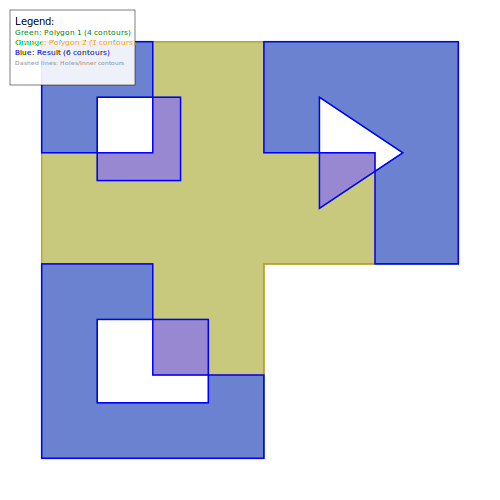

# Martinez Polygon Clipping Library

A TypeScript implementation of the Martinez-Rueda-Feito polygon clipping algorithm for Boolean operations on polygons.

## Features

- **Boolean Operations**: Union, intersection, difference, and XOR operations on polygons
- **Multi-contour Support**: Handles polygons with holes and multiple boundaries
- **TypeScript**: Full type safety with modern ES modules
- **Direct Translation**: Based on the C++ reference implementation
- **Sweep Line Algorithm**: Efficient O(n log n) performance

## Installation

```bash
npm install @avdl/martinez
```

## Usage

```typescript
import { Martinez, Polygon, BooleanOperationType } from '@avdl/martinez';

// Create polygons
const polygon1 = new Polygon([
  [{ x: 0, y: 0 }, { x: 4, y: 0 }, { x: 4, y: 4 }, { x: 0, y: 4 }]
]);

const polygon2 = new Polygon([
  [{ x: 2, y: 2 }, { x: 6, y: 2 }, { x: 6, y: 6 }, { x: 2, y: 6 }]
]);

// Perform Boolean operations
const martinez = new Martinez();
const result = martinez.compute(polygon1, polygon2, BooleanOperationType.UNION);
```

## Boolean Operations

- `UNION` - Combines both polygons
- `INTERSECTION` - Returns overlapping areas
- `DIFFERENCE` - Subtracts second polygon from first
- `XOR` - Returns non-overlapping areas

## Example Visualization

The library generates detailed SVG visualizations for testing complex polygon operations:



*Example showing XOR operation between two complex polygons with multiple holes and contours*

## API Reference

### Core Classes

- **`Martinez`** - Main algorithm implementation
- **`Polygon`** - Container for polygon contours
- **`Point`** - 2D coordinate `{ x: number, y: number }`
- **`Segment`** - Line segment between two points

### Types

```typescript
type Point = { x: number; y: number };
type Contour = Point[];
type Polygon = { contours: Contour[] };

enum BooleanOperationType {
  INTERSECTION,
  UNION,
  DIFFERENCE,
  XOR
}
```

## Development

```bash
# Build the library
npm run build

# Run tests
npm test

# Generate test visualizations
npm run test:martinez

# Type checking
npm run typecheck

# Linting
npm run lint
```

## Testing

The library includes comprehensive test suites with visual SVG output for debugging complex polygon operations. Test results are generated in the `svg-results/` directory.

## Algorithm

This library implements the Martinez-Rueda-Feito sweep line algorithm:

1. **Event Queue**: Processes polygon vertices and intersections in sorted order
2. **Sweep Line**: Maintains active edge segments during the sweep
3. **Intersection Detection**: Finds and handles edge crossings
4. **Result Construction**: Assembles output polygons from processed segments

## License

MIT License - see package.json for details.

## Requirements

- Node.js >= 16.0.0
- TypeScript support for development